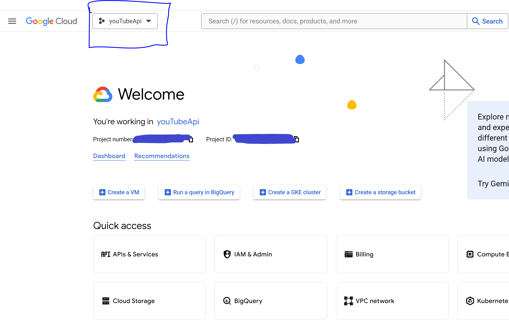
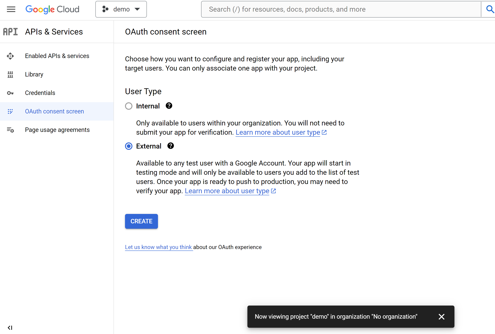
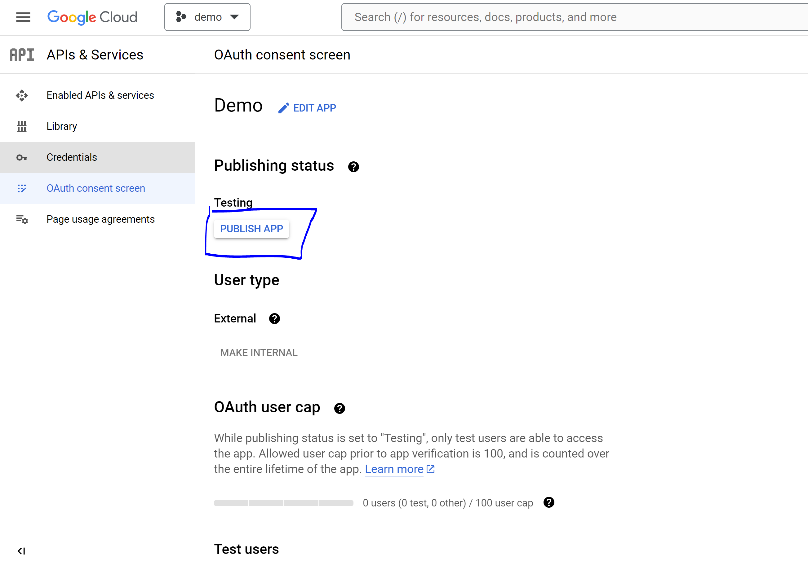
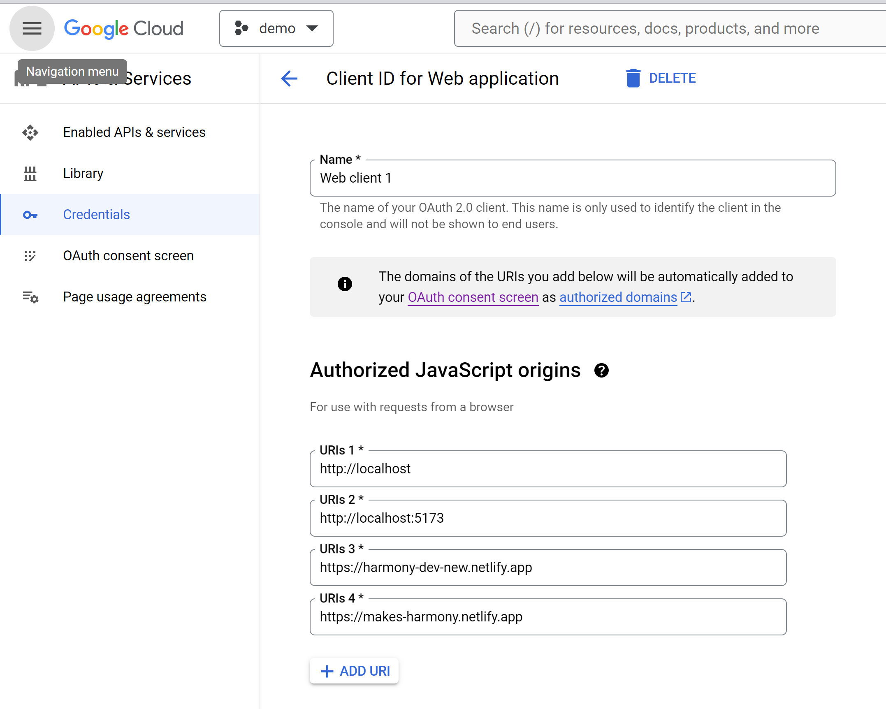
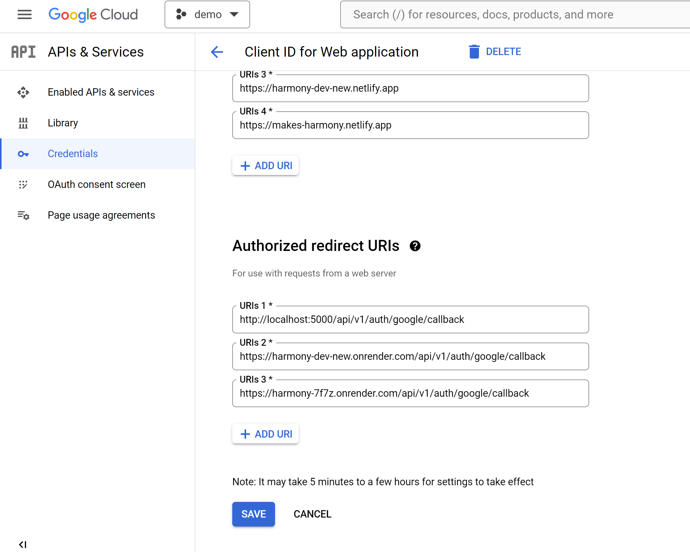
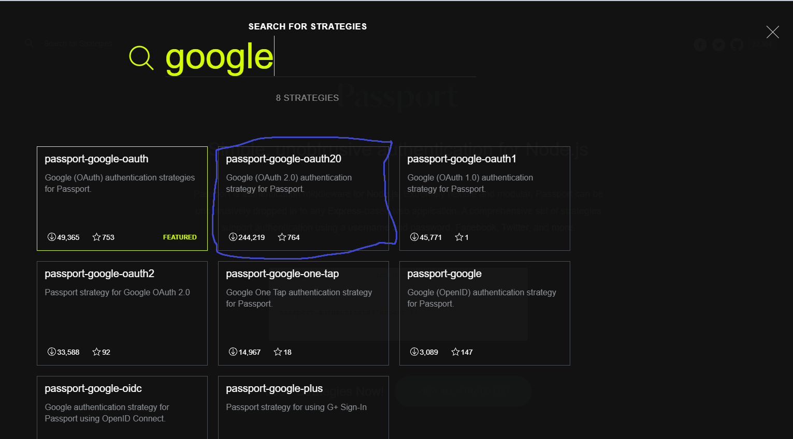

This section guides you through setting up Google authentication in your application using Passport.js. Follow these steps to enable users to sign in with their Google accounts.

### Step 1: Install Passport.js and Google OAuth Strategy

Before you start, ensure you have Passport.js and the Google OAuth strategy installed. If not, run the following command:

```bash
npm install passport passport-google-oauth20
```

### Step 2: Obtain Google API Credentials

#### 1. Go to the [Google Developers Console](https://console.cloud.google.com/apis/dashboard)

#### 2. Create a new project.




#### 3. Configure the consent screen, and set the application type to Web application.






#### 4. Navigate to Credentials, then click on Create credentials, and select OAuth client ID.




#### 5. Add your application's redirect URI, which will be used for the OAuth callback. It usually looks like http://localhost:5000/auth/google/callback.




### Step 3: Configure Passport.js

#### 1. Go to the [Passport.js](https://www.passportjs.org/) and click on Strategies


#### 2. Search for google and choose passport-google-oauth20




#### 3. use the CLIENT_ID and the CLIENT_SECRET, from this screen


```bash
const passport = require('passport');
const GoogleStrategy = require('passport-google-oauth20').Strategy;

passport.use(new GoogleStrategy({
    clientID: YOUR_CLIENT_ID,
    clientSecret: YOUR_CLIENT_SECRET,
    callbackURL: "http://localhost:5000/auth/google/callback"
  },
  function(accessToken, refreshToken, profile, cb) {
    // In this function, find or create a user in your database and call cb
    cb(null, user);
  }
));

```

### Step 4: Implement Routes

```bash
app.get('/auth/google',
  passport.authenticate('google', { scope: ['profile', 'email'] }));

app.get('/auth/google/callback',
  passport.authenticate('google', { failureRedirect: '/login' }),
  function(req, res) {
    // Successful authentication, redirect home.
    res.redirect('/');
  });
```

### Step 5: Testing the Integration

After configuring Passport.js with Google OAuth and setting up your routes, it's crucial to test the integration to ensure that users can authenticate successfully using their Google accounts. Follow these steps to test the Google authentication flow:

#### 1. Start Your Application

Ensure your application is running. If you're using Node.js, you can typically start your application with:

```bash
node app.js
```

#### 2. Access the Authentication Route

Open a web browser and navigate to the route that initiates the authentication process with Google. Based on the previous setup, this URL will be:

```bash
http://localhost:5000/auth/google
```

#### 3. Authenticate with Google

You should be redirected to the Google sign-in page. Choose an account or log in with your Google credentials. After successful authentication, Google will ask for your consent to share your profile and email address with your application.

#### 4. Check the Redirect

After giving consent, you should be redirected back to your application, as specified in your OAuth callback URL. If you set up everything correctly, you should reach the success redirect URL ('/' in the example) after successful authentication.

#### 5. Verify User Information

Ensure that your application correctly receives and processes the user information from Google. This typically involves checking whether the user's data is correctly retrieved in the callback function provided to the GoogleStrategy and whether any user session or database records are correctly updated.

#### 6. Handling Errors

If the authentication process does not work as expected:

Check the console for any errors.
Verify that the CLIENT_ID and CLIENT_SECRET are correctly set.
Ensure the callback URL in your Google project matches the one in your Passport configuration exactly.
Make sure you're handling the failureRedirect properly in your routes to catch any failed authentication attempts.

#### 7. Logging Out

Implement a logout route to allow users to end their session. Here's a simple example:

```bash
app.get('/logout', function(req, res){
  req.logout();
  res.redirect('/');
});
```

This ensures that users can log out of their session in your application, providing a complete authentication flow.
