<p align="center"></p>
<p align="center">
Harmony is a music app that showcases the top 10 songs in Hebrew and the top 10 songs in Arabic, relevant to the current time.
By clicking on a song's title, users can access its lyrics/artist as well as its translation into the other language.
</p>

### Project Frontend Technologies:

- React<br>
- Redux Toolkit & Rtk query<br>
- React Router<br>

### Project Backend Technologies:

- Node.js<br>
- Mongodb<br>
- Express.js<br>
- Pino<br>
- Mocha<br>
- Cheerio<br>
- Puppeteer<br>
- Openai Api<br>
- Spotify Api<br>

### Screenshots


### Local installation

```
git clone https://github.com/Makes-Innovation-Hub/harmony.git
```

After you clone the folder to your computer please open the folder with Vs code and then open your terminal in your Vs code.

In order to run the app locally you will need to install all the dependencies by the following command:<br>

```
npm run installAll
```

In order to config all env files in the client please enter the following command:<br>

```
npm run generate-env-client
```

```
VITE_SERVER_PORT = 5000 || 3000 or the port you prefer.
```

```
VITE_SERVER_BASE_URL = http://localhost || any base url you prefer.
```

In order to config all env files in the server please enter the following command:<br>

```
cd server
```

```
npm run config
```

```
PORT = 5000 || 3000 or the port you prefer
```

```
NODE_ENV = development || production
```

```
MONGO_URI_DEV = explanation below
MONGO_URI_PROD = explanation below
OPEN_AI_API_KEY = explanation below
SPOTIFY_CLIENT_ID = explanation below
SPOTIFY_CLIENT_SECRET = explanation below
```

## Mongo DB setup

- sign in to mongodb website: https://www.mongodb.com/
  
- press "+ New Project" button
  
- give project name
  
- press "Next" button
- press "Create Project" button
  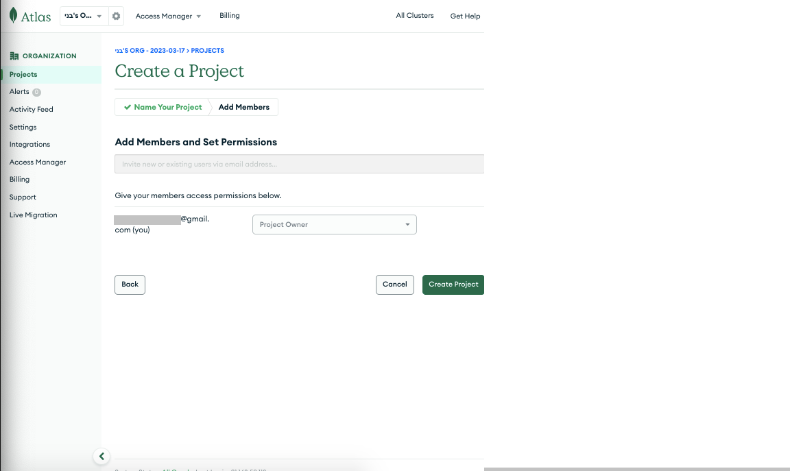
- press "Add Current IP Address" button
  
- press green "+ Create" button
  
- check M0 free option
  
- check aws
  
- pick closest region
  
- give cluster development name
  
- press green "Create" button
  
- check "Username and Password"
  
- give Username and Password
  
- press green "Create User" button
  
- check "Cloud Environment"
  
- IP Address: 0.0.0.0/0
- Description: open for all
  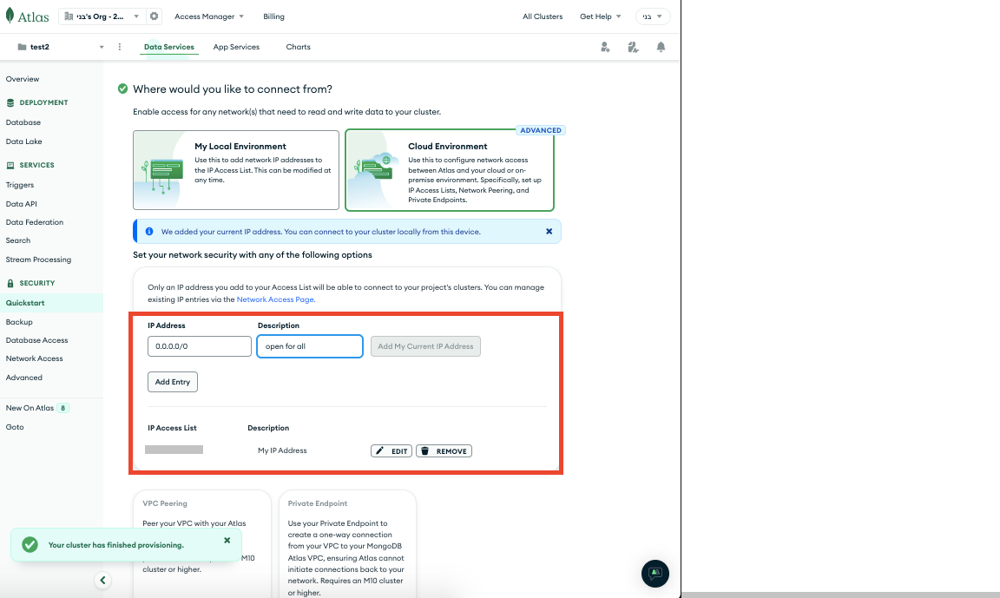
- press "Add Entry" button
  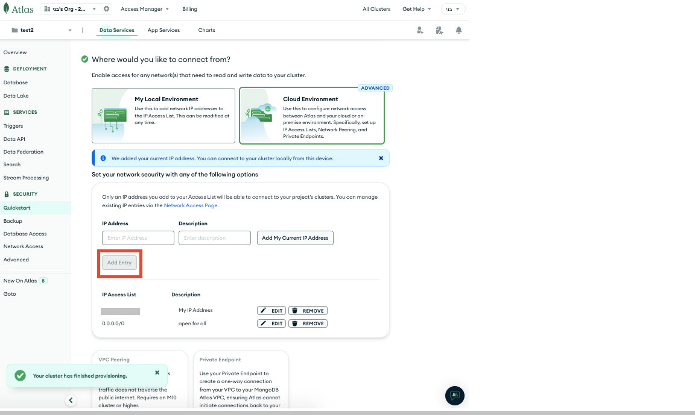
- press "Finish and Close" button
  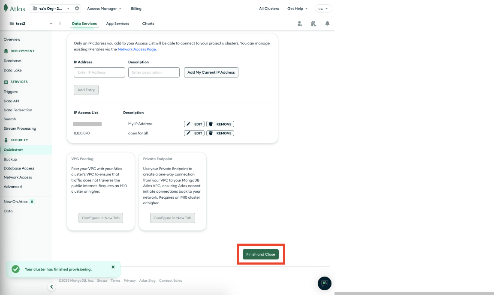
- press "Build a Database" button
  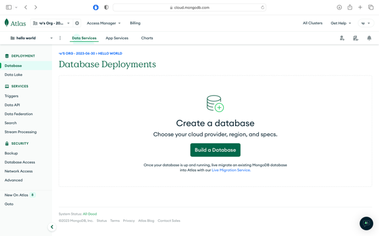
- press "Connect" button
  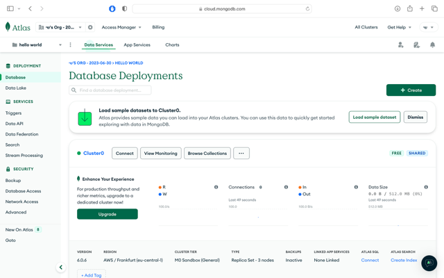
- choose "Drives"
  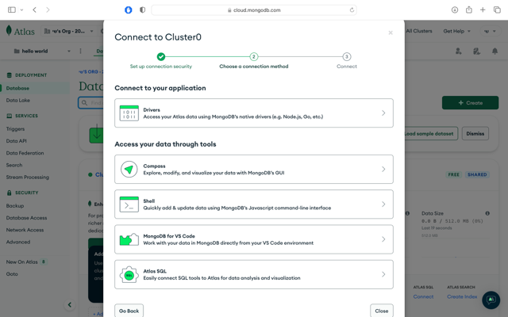
- goto "Add your connection string into your application code" and copy it, inside it enter the password you choose from previous step above.
  

  this lone string will be your MONGO_URI_DEV & MONGO_URI_PROD

## Open AI setup

- open ai website: https://openai.com/
- goto menu
  
- goto Log in
  
- press API box
  
- upper menu right side, press "Personal"
  
- press "View API keys"
  
- press "+ Create new secret key" button
  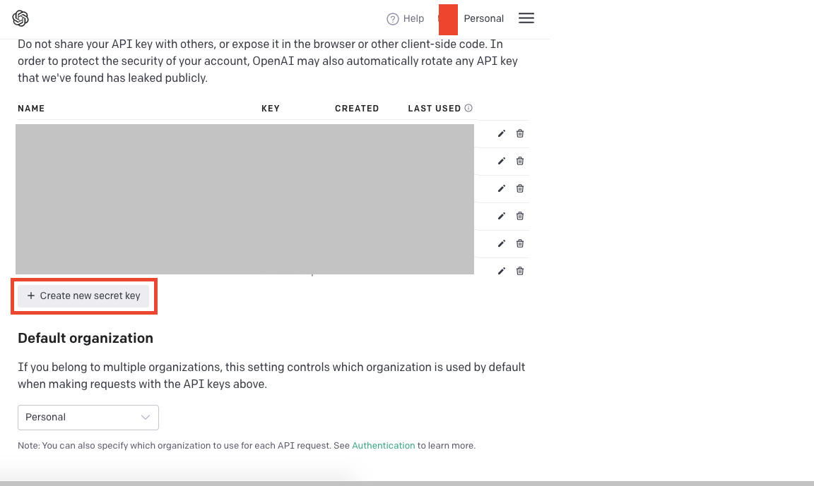

## Spotify setup

- open spotify website for developer: https://developer.spotify.com/
- goto login and log to spotify with the platform you prefer (email/facebook etc..)
- press on the Dashboarded in the username button in the right top corner.
  
- press "Create App"

  

- Enter your details inside the form and press save
  
- choose "Settings" button

  

- There you can find your Spotify client ID & Spotify client secret
  

## Run the application by the following command

In the client folder:<br>

```
1. cd client
2. npm run dev
```

In the server folder:<br>

```
1. cd server
2. nodemon server.js
```

--------------------------------------------------

# Setting Up a YouTube API Key

In order to use the YouTube Data API, you'll need to obtain an API key. Follow the steps below to generate your API key.

## Step 1: Go to the Google Developers Console

Navigate to the [Google Developers Console](https://console.developers.google.com/).

## Step 2: Create a New Project

1. Click on the "Create Project" button.
   

2. Give your project a name and click "Create".
   

## Step 3: Enable the YouTube Data API

1. In the left sidebar, click on "Library".
   
2. Search for "YouTube Data API" and click on it.
   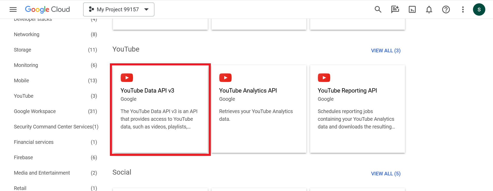
3. Click the "Enable" button.
   

## Step 4: Create Credentials

1. Click on "Create Credentials" button.
   
2. Select the "Public Data" radio button, then click next.
   

## Step 5: Copy Your API Key

After you create the API key, it will be displayed on the screen. Copy this key to use it in the project.
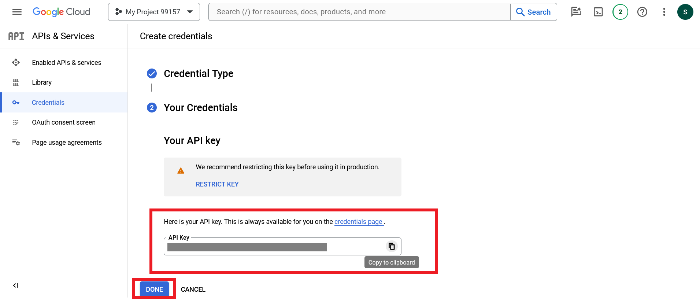

## Step 6: Save API Key as an Environment Variable

Save the API Key as an environment variable for the server with the name "YOUTUBE_API_KEY="

### The API key was used to fetch playlist items and channel profile pics


------------------------------------------

This section guides you through setting up Google authentication in your application using Passport.js. Follow these steps to enable users to sign in with their Google accounts.

### Step 1: Install Passport.js and Google OAuth Strategy

Before you start, ensure you have Passport.js and the Google OAuth strategy installed. If not, run the following command:

```bash
npm install passport passport-google-oauth20
```

### Step 2: Obtain Google API Credentials

#### 1. Go to the [Google Developers Console](https://console.cloud.google.com/apis/dashboard)

#### 2. Create a new project.


#### 3. Configure the consent screen, and set the application type to Web application.


#### 4. Navigate to Credentials, then click on Create credentials, and select OAuth client ID.

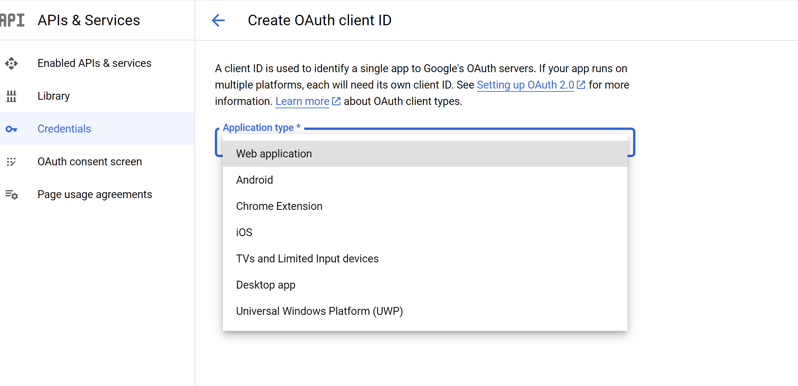
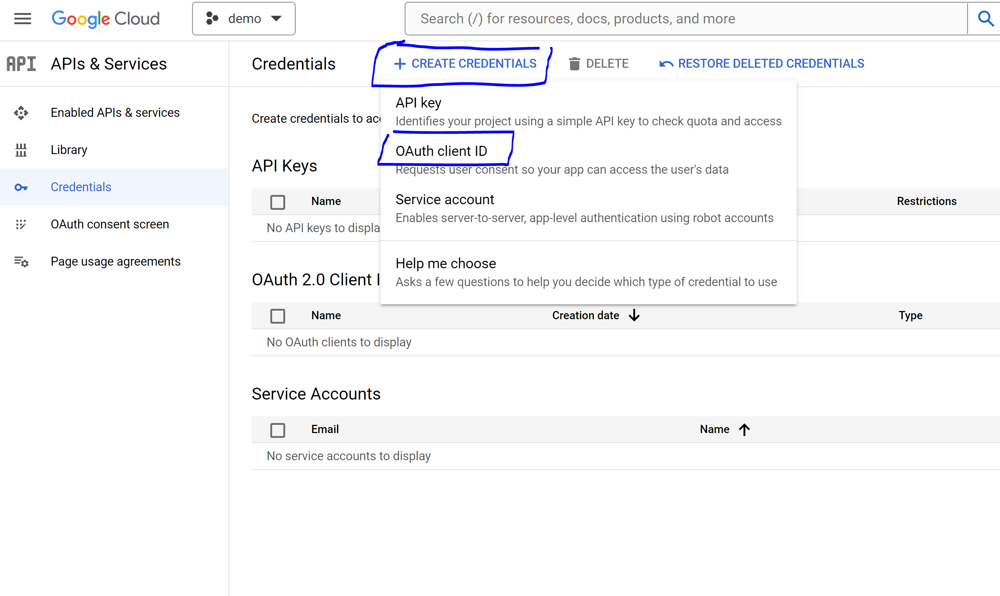


#### 5. Add your application's redirect URI, which will be used for the OAuth callback. It usually looks like http://localhost:5000/auth/google/callback.


### Step 3: Configure Passport.js

#### 1. Go to the [Passport.js](https://www.passportjs.org/) and click on Strategies


#### 2. Search for google and choose passport-google-oauth20


#### 3. use the CLIENT_ID and the CLIENT_SECRET, from this screen


```bash
const passport = require('passport');
const GoogleStrategy = require('passport-google-oauth20').Strategy;

passport.use(new GoogleStrategy({
    clientID: YOUR_CLIENT_ID,
    clientSecret: YOUR_CLIENT_SECRET,
    callbackURL: "http://localhost:5000/auth/google/callback"
  },
  function(accessToken, refreshToken, profile, cb) {
    // In this function, find or create a user in your database and call cb
    cb(null, user);
  }
));

```

### Step 4: Implement Routes

```bash
app.get('/auth/google',
  passport.authenticate('google', { scope: ['profile', 'email'] }));

app.get('/auth/google/callback',
  passport.authenticate('google', { failureRedirect: '/login' }),
  function(req, res) {
    // Successful authentication, redirect home.
    res.redirect('/');
  });
```

### Step 5: Testing the Integration

After configuring Passport.js with Google OAuth and setting up your routes, it's crucial to test the integration to ensure that users can authenticate successfully using their Google accounts. Follow these steps to test the Google authentication flow:

#### 1. Start Your Application

Ensure your application is running. If you're using Node.js, you can typically start your application with:

```bash
node app.js
```

#### 2. Access the Authentication Route

Open a web browser and navigate to the route that initiates the authentication process with Google. Based on the previous setup, this URL will be:

```bash
http://localhost:5000/auth/google
```

#### 3. Authenticate with Google

You should be redirected to the Google sign-in page. Choose an account or log in with your Google credentials. After successful authentication, Google will ask for your consent to share your profile and email address with your application.

#### 4. Check the Redirect

After giving consent, you should be redirected back to your application, as specified in your OAuth callback URL. If you set up everything correctly, you should reach the success redirect URL ('/' in the example) after successful authentication.

#### 5. Verify User Information

Ensure that your application correctly receives and processes the user information from Google. This typically involves checking whether the user's data is correctly retrieved in the callback function provided to the GoogleStrategy and whether any user session or database records are correctly updated.

#### 6. Handling Errors

If the authentication process does not work as expected:

Check the console for any errors.
Verify that the CLIENT_ID and CLIENT_SECRET are correctly set.
Ensure the callback URL in your Google project matches the one in your Passport configuration exactly.
Make sure you're handling the failureRedirect properly in your routes to catch any failed authentication attempts.

#### 7. Logging Out

Implement a logout route to allow users to end their session. Here's a simple example:

```bash
app.get('/logout', function(req, res){
  req.logout();
  res.redirect('/');
});
```

This ensures that users can log out of their session in your application, providing a complete authentication flow.


----------------------------------------